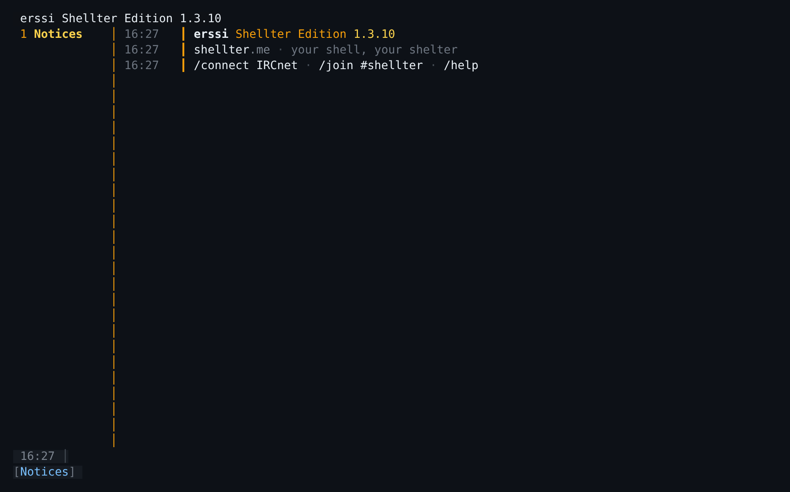

# erssi Shellter Edition

**Your shell, your shelter — on IRCnet.**

[](https://github.com/y-o-o-z/erssi/releases)
[](https://github.com/erssi-org/erssi)
[](https://github.com/irssi/irssi)
[](COPYING)

erssi Shellter Edition is yooz's edition of
[erssi](https://github.com/erssi-org/erssi), the modern irssi created by
Jerzy “kofany” Dąbrowski and the erssi-org team. It keeps everything erssi
brings — sidepanels, mouse support, 24-bit colour, image preview, a web
frontend and full irssi Perl script compatibility — and tunes it for people
who live on IRCnet: a polished default theme, help for every command, a
signed installer that also updates, and a security review of the parts that
face the network.



## Install

One command, no root, about two minutes on a shell box:

```sh
curl -fsSL https://raw.githubusercontent.com/y-o-o-z/erssi/main/shellter-install.sh | sh
```

The installer checks the system first. Run as **root**, it lists the
packages erssi needs (required and recommended, named for apt, dnf, apk,
pacman, zypper or FreeBSD pkg) and installs them once you confirm (`--yes`
skips the question; root must use its own home - `sudo -i` or `su -`); on
a **user account** it lists the missing packages with the command to give
the administrator. Without system `meson`/`ninja`
it installs them into a private Python environment. It then builds the
newest release recorded in the installer — only if its tag points to the
recorded commit and, from 1.3.8 on, carries a valid signature by the release
key (checked with git 2.34+ and ssh-keygen; without them the installer warns
and checks the commit only) — runs the test suite and installs to
`~/.local/opt/erssi`, linked as
`~/.local/bin/erssi`. Every step is one line; the build output goes to
`~/.local/state/erssi/install.log`, shown when a step fails. Works on Linux
and FreeBSD. Options: `--prefix`, `--ref <tag|branch|commit>` (anything that
is not a recorded release is built with a warning; a commit as the full SHA), `--no-test`, `--clean` (remove
the build directory afterwards, for small disk quotas), `--yes`.

### Update

```sh
erssi --check-update     # is a newer release available?
erssi --update           # build and install it
```

`erssi --update` runs the installer shipped with the installed release: it
takes the newest release on GitHub that carries a valid signature by the key
of that installer (a tag pushed by anyone else is skipped), builds, tests
and installs it into the same prefix, with the settings of the first install.
A release of the installed version published again with changes (its
signed tag moved to a new commit) counts as an update too. Nothing is built
when erssi is up to date. In a running erssi, `/upgrade` then loads the new
version without disconnecting.

Releases are signed with an SSH key (ED25519,
`SHA256:hF7dvX7vdTfqEsC9LHeujMoHf4NhWdqeBCvN6jXEDAw`, public key in
[`utils/allowed_signers`](utils/allowed_signers)). To check a release by hand:
`git -c gpg.ssh.allowedSignersFile=utils/allowed_signers verify-tag shellter-v1.3.8`.

erssi keeps its configuration in `~/.erssi/`, so it runs side by side with
irssi. Start it inside tmux so the session survives logging out.

The themes and the `startup` file erssi copies into `~/.erssi/` are updated
with erssi, like the configuration files of a system package: a copy you
have not changed is replaced by the new version on the next start; a copy
you changed (also by `/save -formats`) is never touched, and erssi says once
where the new version is. The sha256 of what erssi installed is kept in
`~/.erssi/default-files.sha256`. Symbolic links are left alone.

<details>
<summary>Manual build</summary>

Debian / Ubuntu:

```sh
sudo apt install git gcc meson ninja-build pkgconf libglib2.0-dev libssl-dev \
  libperl-dev libutf8proc-dev libgcrypt20-dev libotr5-dev \
  libcurl4-openssl-dev libchafa-dev
```

FreeBSD: `pkg install git meson ninja pkgconf glib perl5 utf8proc libgcrypt libotr curl chafa`

```sh
git clone https://github.com/y-o-o-z/erssi.git && cd erssi
meson setup Build -Dprefix="$HOME/.local/opt/erssi" -Dwith-proxy=yes
ninja -C Build && meson test -C Build && ninja -C Build install
```

GLib (2.32 or newer) and OpenSSL are required, and Perl to build (the
build generates sources with it). Perl scripting (libperl), utf8proc,
libcurl + chafa (image preview) and libotr + libgcrypt (OTR) are detected
and used when present. For a system-wide install use
`-Dprefix=/usr/local` and `sudo ninja -C Build install`.
</details>

## Version

| | |
|---|---|
| **erssi Shellter Edition 1.3.10** | erssi 1.3.1 (erssi-org, 2026-04-06) with the changes below. Release notes: [NEWS](NEWS). |
| **irssi core** | irssi 1.4.5 plus irssi `master` up to 2025-07-26, as merged by erssi-org. |
| **Perl scripts** | `Irssi::version()` returns the release date, so scripts that require irssi 1.4.5 or newer load. `$J` is erssi's own version (`1.3.10`). |

## What this edition adds

### Look and feel

- **`shellter` theme by default** — a dark theme in the colours of
  [shellter.me](https://shellter.me). Messages, events, server replies,
  WHOIS, notices and private messages share one column and one separator,
  so text always starts in the same place and wrapped lines continue under
  it. Joining a channel prints one summary line
  (`#chan: nicks 70 · ops 29 · voiced 4 · regular 37`) instead of a nick table.
  For terminals with a light background there is `shellter-light`, the same
  layout in light colours with every text colour at 4.5:1 or more on white
  ([screenshot](docs/images/erssi-shellter-light.png)): `/set theme shellter-light`,
  with the matching nick colours listed at the top of `themes/shellter-light.theme`.
- **Rank colours** — `$nickmode` and `nick_mode_color_*` draw `@`, `+`, `%`
  and `~`/`&` in their own colours in messages and in the nick list;
  `nick_hash_colors` accepts 24-bit colours.
- **Read marker in the column** — the bundled trackbar branches off the
  separator (`├────`) instead of cutting through timestamps and nicks.
- **Activity that means something** — a quit or nick change marks only the
  windows where that nick is, not every window of the network.
- **Clean windows** — network windows open without `/WINDOW` chatter and
  without server tags on every line; WHOIS replies go to the network window
  (`print_whois_rpl_in_server_window`), not into the channel you are reading.
- **Themeable statusbar** — the colours of the statusbar items (time,
  nick, window, activity, lag, prompt) come from the theme (`sb_*`
  abstracts), with one continuous bar background.
- **Every terminal** — 24-bit colour where the terminal shows it, the
  nearest 256-colour entry where it does not (GNU Screen, Linux console,
  rxvt-unicode, 8/16-colour terminals). `/set term_truecolor auto|on|off`
  overrides it.

### Help for every command

`/help` covers every command, including the erssi commands that had no help
(`credential`, `fe_web`, `floodnet`, `foreach`, `image`, `nickhash`, …) and
the commands of the bundled scripts.
Help files in `~/.erssi/help/` are read first — drop in a file named after a
command to document your own scripts.

### Bundled scripts

Installed in `<prefix>/share/irssi/scripts` next to the scripts erssi ships,
loaded on demand (`/script load <name>`, or a symlink in
`~/.erssi/scripts/autorun/`).

| Script | What it does |
|---|---|
| `mentions.pl` | One *Mentions* window for highlights, private messages, notices and DCC, mirrored to a log file (0600). `/mentions`. |
| `trackbar.pl` | The read marker of trackbar 2.9, drawn as `├────` from the theme's separator column when the theme has one. `/mark`, `/trackbar`. |
| `webjournal.pl` | Journals every window (one JSON line per message, files only you can read) so a web client that reads the journal shows the same windows and history as the terminal. |

### Reliability

- **Anti-floodnet without collateral damage** — counts different senders,
  so one person pasting lines is no longer a flood; never filters people you
  have a query with; ends protection on its own; bounded memory; no crash on
  messages from servers.
- **Sidepanels** — turning a panel off or changing its width gives the space
  back; a terminal narrower than the panels (a phone over ssh) keeps a
  usable window; stale scroll arrows, a leak on every panel hide and a crash
  path on very tall terminals are fixed.
- **Input line** — control characters (bold, colour) are visible and the
  cursor stays on the text.
- **Message formats** — messages to `@#channel` show the right nick.
- **Slow web clients** — output to a web client that reads slowly (a
  phone on mobile data, a large state dump) is queued in order instead of
  dropped; a client that never reads is disconnected at 32 MB.
- **FreeBSD** — builds and runs, including `/connect` inside Capsicum
  capability mode.

### Security

The network-facing parts were reviewed, fuzzed and tested under
sanitizers.

- **Web frontend (fe-web)** — built for a shared shell box: the password
  travels in an `Authorization` header, never in a URL; one guess per
  connection, compared in constant time; after 5 wrong passwords in a
  minute one login is checked every 2 s (a pace, not a lockout someone
  else on the box could use against you); 16 KB and 10 seconds to log in,
  with a separate limit for connections still logging in; at most 16
  clients; oversized frames and oversized or fragmented control frames
  refused. The TLS certificate is kept in `~/.erssi/fe-web-cert.pem` and the
  web client trusts exactly that certificate, so nothing else listening on
  the port can receive the password. The key is made only once fe-web is
  enabled, kept at mode 0600 and replaced if anyone else could read it. Web
  connections are not inherited by programs that scripts start.
- **Image preview** — http and https only, public addresses only (also after
  redirects), a hard size limit, and no decoding of images too large to
  handle safely. The debug log of clicked URLs is off by default.
- **Configuration** — `~/.erssi/config` is written readable only by you.
- **Hardened build** — by default: PIE, stack protector, stack clash
  protection, `FORTIFY_SOURCE=2`, full RELRO.
- **Tested the hard way** — everything fe-web reads from the network (the
  login request, WebSocket frames, encrypted frames, client messages, IRC
  lines turned into web events) is fuzzed with libFuzzer under AddressSanitizer
  and UndefinedBehaviorSanitizer; every finding is replayed by `meson test`.
  The test suite also runs under both sanitizers.
- **Credential encryption** — switched off: in erssi 1.3.1 it never
  encrypted the configuration file and a wrong master password could delete
  stored credentials. Existing setups keep working; `/help credential`
  explains how to return to plain storage.

## Configuration

```
/set theme shellter                       # the default
/set nick_mode_color_voice %Z79C0FF%_     # rank colours: _owner, _op, _halfop, _voice, _normal
/set print_whois_rpl_in_server_window on  # off: WHOIS in the active window
/set anti_floodnet_notices off            # hide Anti-Floodnet notices
/set term_truecolor auto                  # on / off to override terminal detection
/set theme shellter-light                 # for terminals with a light background
/set fe_web_socket ~/.erssi/fe-web.sock   # web frontend on a Unix socket (shared boxes)
```

In tmux, enable RGB colour with `set -as terminal-features ',*:RGB'`.

## Web client

fe-web lets a web client such as [NexusIRC](https://github.com/kofany/nexus)
by kofany show the same erssi session in a browser, with every command
executed by erssi.

```
/set fe_web_password <long random secret>
/set fe_web_bind 127.0.0.1
/set fe_web_enabled on
/script load webjournal                   # windows and history for the web client
/save
```

On a shared box, listen on a Unix socket instead of the loopback port,
which every user of the box can connect to (the web client has to support
connecting to a socket):

```
/set fe_web_socket ~/.erssi/fe-web.sock
```

The socket is readable and writable only by you (0600, in a directory only
you can write to) and connections from other users' processes are refused;
TLS and the password work as on TCP. `/help fe_web` has the details.

Keep fe-web on `127.0.0.1`; expose only the web client, behind TLS.

## End-to-end encryption

[contrib/rpe2e](contrib/rpe2e/README.md) carries `rpe2e.pl`, the RPE2E v1.0
script from [repartee](https://github.com/outragedevs/repartee), adapted to
erssi. It is wire-compatible with repartee and WeeChat: `/e2e on` in a
channel encrypts it (XChaCha20-Poly1305, per-sender keys, CTCP key exchange).
A migration tool moves an existing repartee identity, so peers see no key
change.

## Development

```sh
meson test -C Build                               # unit tests and fuzz corpus replays
ln -sf ../../utils/pre-push .git/hooks/pre-push   # build, tests and history checks before every push
meson setup Build-asan -Db_sanitize=address,undefined -Db_lundef=false
meson test -C Build-asan                          # the same tests under ASan and UBSan
git remote add upstream https://github.com/erssi-org/erssi.git
git fetch upstream && git merge upstream/main     # follow erssi
```

Tests run with `HOME` inside the build directory, so building and testing
never writes into your own `~/.erssi`. `utils/pre-push` builds, runs the
tests and checks the release tags before every push.
`.github/workflows/shellter-ci.yml` describes the same hardened and
sanitizer builds and the installer checks for GitHub Actions, which are
switched off on this repository for now.

Changes are kept in topic commits that explain the problem they solve, so
upstream merges stay reviewable.

## Credits and license

- **erssi** — Jerzy “kofany” Dąbrowski and the erssi-org team,
  [erssi-org/erssi](https://github.com/erssi-org/erssi).
- **irssi** — the irssi developers, [irssi.org](https://irssi.org).
- **NexusIRC** — kofany, [kofany/nexus](https://github.com/kofany/nexus).
- **RPE2E** — the repartee authors (MIT, [contrib/rpe2e/LICENSE](contrib/rpe2e/LICENSE)).
- **Shellter Edition** — yooz, [y-o-o-z/erssi](https://github.com/y-o-o-z/erssi).

GPL-2.0-or-later, like irssi and erssi. `contrib/rpe2e` is MIT.
